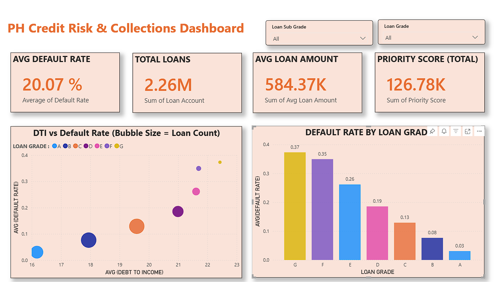
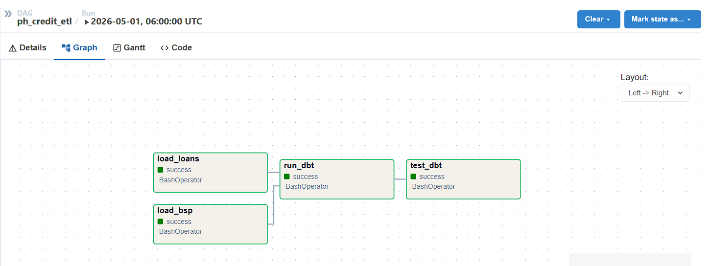
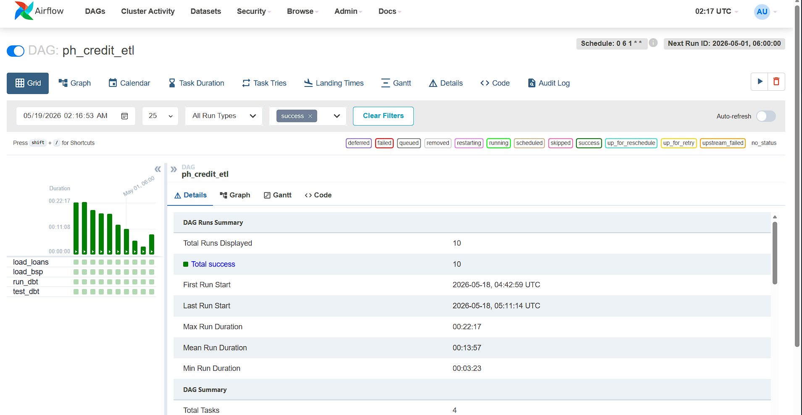
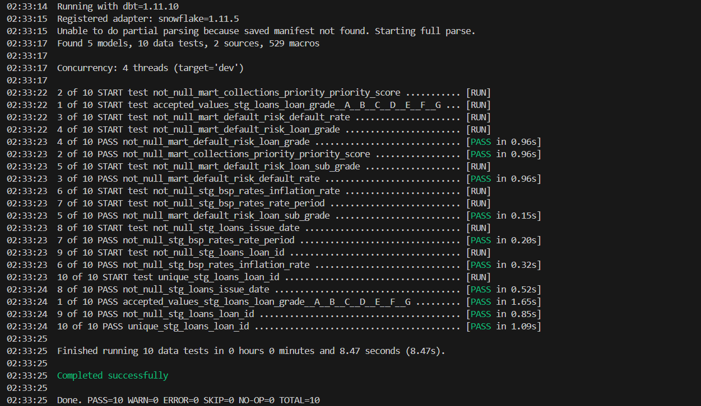
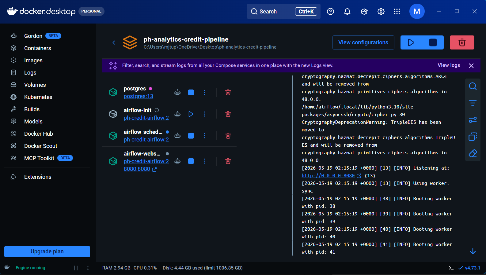

<!--
FILE: README.md
PURPOSE: Project overview for GitHub repository homepage
PHASE: 0-7
DEPENDS ON: project codebase and docs/ folder
OUTPUTS: High-level project documentation
-->

# PH Credit & Collections Analytics Pipeline

## Overview

End-to-end ELT pipeline for Philippine credit risk and collections. It combines loan performance data with BSP-style macro indicators and produces prioritized segments for collections follow-up.

## Business Question

Given current macro conditions and loan performance, which segments have the highest default risk and should be prioritized for collections?

## Tech Stack

- Python
- Snowflake
- dbt
- Airflow
- Docker + Docker Compose
- GitHub Actions
- Power BI

## Pipeline Flow

See the full Mermaid diagram in [docs/flowchart.md](docs/flowchart.md).

## Key Outputs

- Collections priority scores: [dbt/models/mart/mart_collections_priority.sql](dbt/models/mart/mart_collections_priority.sql)
- Default risk by segment: [dbt/models/mart/mart_default_risk.sql](dbt/models/mart/mart_default_risk.sql)

## Quick Start (Local)

1. Create and activate a Python venv.
2. Install dependencies from [requirements.txt](requirements.txt).
3. Create `.env` from `.env.example` and fill in Snowflake values (do not commit).
4. Load env vars: `./scripts/load_env.ps1`.
5. Run dbt tests: `cd dbt` then `dbt test`.

## Dashboard

Power BI connects to MART tables and shows default risk, DTI vs default, and priority scores.

## Screenshots

## Documentation

- Full walkthrough: [docs/phase_all_walkthrough.md](docs/phase_all_walkthrough.md)
- All docs index: [docs/README.md](docs/README.md)
