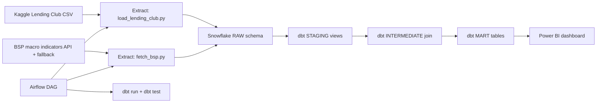

<!--
FILE: README.md
PURPOSE: Comprehensive documentation for the pipeline
PHASE: 0-7
DEPENDS ON: project codebase and docs/ folder
OUTPUTS: Project overview, architecture, and run guidance
-->

# PH Credit & Collections Analytics Pipeline

## Overview

This project is a production-style ELT pipeline for a Philippine collections use case. It combines loan performance data (Lending Club as a proxy) with macro indicators to answer a core business question: which loan segments should collections prioritize under current macro conditions.

## Business Question

Given BSP-like macro conditions and current loan performance, which segments have the highest default risk and should be prioritized for collections follow-up?

## Data Sources

- Lending Club CSV (Kaggle) as a proxy for PH loan portfolio exports
- BSP-style macroeconomic indicators (inflation, policy rate, lending rate)

## Architecture

Snowflake is organized into three schemas to keep data auditable and transformations reliable:

- RAW: immutable copies of source data
- STAGING: cleaned and typed dbt views
- MART: business-ready aggregates and prioritization outputs

## Tech Stack

- Python for extraction and loading
- Snowflake for the data warehouse
- dbt for SQL transformations and testing
- Airflow for orchestration
- Docker + Docker Compose for consistent runtime
- GitHub Actions for CI (dbt compile and unit tests)
- Power BI for the dashboard

## Pipeline Flow

See the Mermaid flowchart in [docs/flowchart.md](docs/flowchart.md).

## Key Outputs

- Collections priority scores by segment: [dbt/models/mart/mart_collections_priority.sql](dbt/models/mart/mart_collections_priority.sql)
- Default risk by segment: [dbt/models/mart/mart_default_risk.sql](dbt/models/mart/mart_default_risk.sql)

## How to Run (Local)

1. Create and activate a Python venv.
2. Install dependencies from [requirements.txt](requirements.txt).
3. Set Snowflake credentials in .env (never commit this file).
4. Run extraction scripts in [extract/](extract/).
5. Load to Snowflake with [load/snowflake_loader.py](load/snowflake_loader.py).
6. Run dbt: `dbt debug`, `dbt run`, `dbt test`.

## How to Run (Docker + Airflow)

1. Build and start containers with `docker compose up -d`.
2. Open Airflow at http://localhost:8080.
3. Trigger the DAG in [dags/ph_credit_etl_dag.py](dags/ph_credit_etl_dag.py).

## Dashboard

The Power BI dashboard connects to the MART tables and visualizes:

- Default rate by loan grade
- DTI vs default rate (bubble size = loan count)
- KPI cards for default rate, loan count, average loan amount, and priority score

## Screenshots

## Testing and Quality

- dbt tests enforce not-null, unique, and accepted values
- Unit tests live in [tests/](tests/)

## Security and Cost Controls

- Credentials stored in .env and GitHub Secrets
- Snowflake warehouse configured with AUTO_SUSPEND
- RAW data preserved for auditability in a finance context

## Repository Docs

- End-to-end walkthrough: [docs/phase_all_walkthrough.md](phase_all_walkthrough.md)
- Phase 0 overview: [docs/phase_0_overview.md](phase_0_overview.md)
- Phase 1 setup: [docs/phase_1_setup.md](phase_1_setup.md)
- Phase 2 extract: [docs/phase_2_extract.md](phase_2_extract.md)
- Phase 3 load: [docs/phase_3_load.md](phase_3_load.md)
- Phase 4 transform: [docs/phase_4_transform.md](phase_4_transform.md)
- Phase 5 Airflow: [docs/phase_5_airflow.md](phase_5_airflow.md)
- Phase 6 Docker + CI/CD: [docs/phase_6_ci_cd.md](phase_6_ci_cd.md)
- Phase 7 dashboard: [docs/phase_7_dashboard.md](phase_7_dashboard.md)
