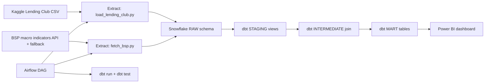

<!--
FILE: flowchart.md
PURPOSE: Mermaid flowchart for the end-to-end pipeline
PHASE: 0-7
DEPENDS ON: project architecture
OUTPUTS: Visual system flow diagram
-->

# Pipeline Flowchart

```mermaid
flowchart LR
  %% Sources
  A[Kaggle Lending Club CSV] --> B[Extract: load_lending_club.py]
  C[BSP macro indicators API + fallback] --> D[Extract: fetch_bsp.py]

  %% Warehouse
  B --> E[Snowflake RAW schema]
  D --> E

  %% Transformations
  E --> F[dbt STAGING views]
  F --> G[dbt INTERMEDIATE join]
  G --> H[dbt MART tables]

  %% Analytics
  H --> I[Power BI dashboard]

  %% Orchestration
  J[Airflow DAG] --> B
  J --> D
  J --> K[dbt run + dbt test]
```
