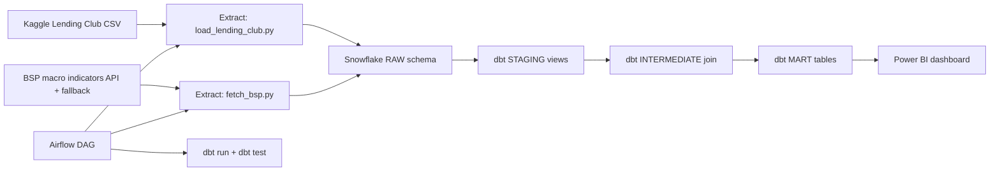

<!--
FILE: system_flow.md
PURPOSE: Describe the end-to-end pipeline flow and current status
PHASE: 2
DEPENDS ON: extract scripts, Snowflake, dbt, Airflow, dashboard
OUTPUTS: A readable flow guide and Mermaid diagram
-->

# Pipeline Flow and Status

## Overview

This document explains the step-by-step flow of the ELT pipeline and shows how each component connects. It is meant to guide you through the system logic before we build the remaining phases.

## Current Status

- Phase 1 complete: environment setup and Snowflake connection test.
- Phase 2 complete: Lending Club extraction and BSP macro fetch with fallback.
- Phase 3-7 complete: load, dbt, Airflow, CI/CD, and Power BI dashboard.

## Step-by-step Flow

1. Source loan data from the Kaggle Lending Club CSV in data/.
2. Extract a preview of loans with chunked reading (keeps memory safe).
3. Fetch macro data from BSP-style indicators (with a fallback if the API is unavailable).
4. Load both datasets into Snowflake RAW schema (Phase 3).
5. Transform data in dbt: staging -> intermediate join -> marts (Phase 4).
6. Orchestrate the pipeline with Airflow (Phase 5).
7. Containerize and test with Docker and CI (Phase 6).
8. Visualize outputs in Power BI for collections prioritization (Phase 7).

## Flowchart

<!-- Mermaid diagram renders in GitHub and VS Code preview -->

